# 基于大数据技术的纵横小说网站数据分析与处理系统的设计与实现

> 公开脱敏版：保留论文正文与技术插图；学校模板、页眉页脚、校徽、身份元数据不进入公开文件，含个人资料或凭据的截图已隐藏。

目  录

## 绪论

研究背景和意义

随着互联网的普及和发展，网络上的小说阅读越来越受到人们的关注和喜爱。纵横小说网是国内最具影响力的小说网站之一，拥有众多作者和读者，提供了海量的小说资源。本论文选题旨在利用大数据分析与处理技术，对纵横小说网的数据进行深入研究和分析，具有以下重要意义：

首先，研究纵横小说网数据有助于了解当前阅读市场的趋势和需求。通过对小说作品进行分析，可以发现受欢迎的小说类型、作者、题材等信息，为读者提供更加精准的推荐和选择。同时，对排行榜的变化趋势进行监测，对于网站的运营者来说，能够及时把握读者的偏好，优化推荐算法，提升用户体验。

其次，通过大数据分析纵横小说网数据，可以挖掘出潜在的优秀作者和作品。从大数据中发现作者的创作规律、读者的评价和反馈，从而对作者的创作风格、作品质量等进行评估和筛选。同时，对于作品的分析还能发现用户阅读的偏好，有助于引导作家创作更符合读者需求、更受欢迎的小说作品。

最后，本研究对于提升信息处理和技术应用能力也具有重要意义。在研究中，将应用大数据分析和处理技术对海量的纵横小说网数据进行整理和统计。这对于数据处理、模型建立、算法优化等方面提出了挑战，有助于提升相关技术的研究与应用水平。

本论文选题有助于了解阅读市场趋势、发现潜在优秀作者和作品，并且提升信息处理和技术应用能力。通过对纵横小说网大数据的研究与分析，对于读者、作者和网站运营者都具有实际意义，有助于优化用户体验、推动文学创作和满足人们对优质小说的需求。

国内外研究现状

在国内，已经有一些学者对小说网站的数据进行了研究。其中，一些研究集中在数据的分析与挖掘上，通过利用机器学习和数据挖掘算法，提取出受欢迎的小说类型、作者及其特征等信息。另外，还有研究关注数据和用户行为之间的关联，通过分析用户的浏览、阅读和评论等行为数据，揭示了数据对用户选择和阅读行为的影响。

在国外，对于大数据分析与处理在小说阅读平台的应用研究也有一定的进展。一些研究关注于小说网站的内容推荐系统，利用协同过滤算法、模型推荐等方法，为用户提供个性化的推荐服务。此外，还有研究聚焦于对小说作者和作品的分析，通过挖掘大数据，发现了作者的创作规律、作品的热度趋势以及读者的喜好等方面的信息。

国内外研究者对纵横小说网大数据的习通分析与处理已经有了一定的探索和研究。国内学者主要关注数据的分析与挖掘以及与用户行为的关联，而国外研究则更加注重小说作品的推荐及作者创作规律的发现。然而，纵横小说网大数据的习通分析与处理仍然存在着许多问题和挑战，例如数据准确性、算法精确度、用户隐私保护等方面，因此该领域仍有待进一步的研究和探索。

研究内容

数据收集和清理：该研究涉及使用Python网络抓取技术从纵横小说网收集数据。随后，进行彻底的数据清洗过程，以确保数据集的准确性和可靠性。

MySQL数据库中的数据存储：收集和清理的数据有效地存储在MySQL数据库中。这可确保数据井然有序且易于分析。

使用Spark SQL进行深度数据分析：该研究采用Spark SQL进行全面的数据分析。这涉及探索数据集中的用户阅读偏好和趋势，为平台上读者的行为提供有价值的见解。

交互式数据呈现系统：建立了交互式数据呈现系统，后端采用Spring Boot，前端采用Vue。该系统允许用户通过各种方式可视化数据，增强他们对分析信息的理解。

数据生成请求：用户可以通过系统发起数据生成请求。此功能为研究添加了交互元素，使用户能够根据自己的喜好生成特定数据。

历史任务结果：用户还可以通过系统查看历史任务结果。此功能为用户提供了比较和分析不同数据生成请求的结果的参考点。

总体来看，该研究集数据采集、存储、分析、可视化于一体，为了解阅读市场趋势、发现潜在的优秀作者和作品、提升网络文学领域的信息处理和技术应用能力提供了实质性支撑。

本章小节

本文主要阐述了该系统的分析，设计，实现，测试过程，本文共分为六章：

## 第一章主要描述本系统的开发背景与意义，阐述本系统的实现思路，概述本系统的国内外发展现状；

## 第二章对本系统实现的关键技术，模块进行阐述，比如Spring Boot框架，Spark MySQl，Scrapy，Python；

第三章为系统需求分析章节，主要对系统进行业务需求分析，功能用例分析，非功能性需求分析，可行性分析，通过仔细的分析，来保障系统在当前环境，当前技术下是可以实现的；

## 第四章为系统设计，从系统架构设计，系统软件流程设计，系统数据库表设计阐述系统设计过程，然后根据设计结果结合关键技术，进行系统的实现，并贴出实现结果；

## 第七章为系统测试，测试系统关键功能是否能够正常运行；

## 第六章为结论部分，对全文进行总结，并提出系统目前不足之处。

## 关键技术介绍

服务端技术

Python

Python 是一种高级、动态类型的编程语言，自从 1991 年首次发布以来，已经成为全球范围内广泛应用的编程语言之一。Python 的特点包括简洁、易读、可扩展性强，以及拥有庞大的开源社区。这些优势使得 Python 成为了开发网络安全检测系统的理想选择。

Python 语法简洁、易读，有助于提高开发效率，降低维护成本。这种简洁性使得 Python 代码更容易理解和修改，对于开发网络安全检测系统这样需要频繁更新和维护的项目而言，Python 的易用性大大提高了开发效率。

Python 拥有强大的标准库和丰富的第三方库，这些库为开发者提供了许多现成的功能和工具，可以大大减少开发工作量。在网络安全领域，Python 社区已经为开发者提供了大量的安全相关库，如 Requests、BeautifulSoup、Scrapy 等用于网络爬虫，Nmap、Scapy 等用于网络扫描，以及 Django、Flask 等 Web 框架。这些库简化了网络安全检测系统的开发过程，为开发者提供了丰富的资源，如图2-1所示。

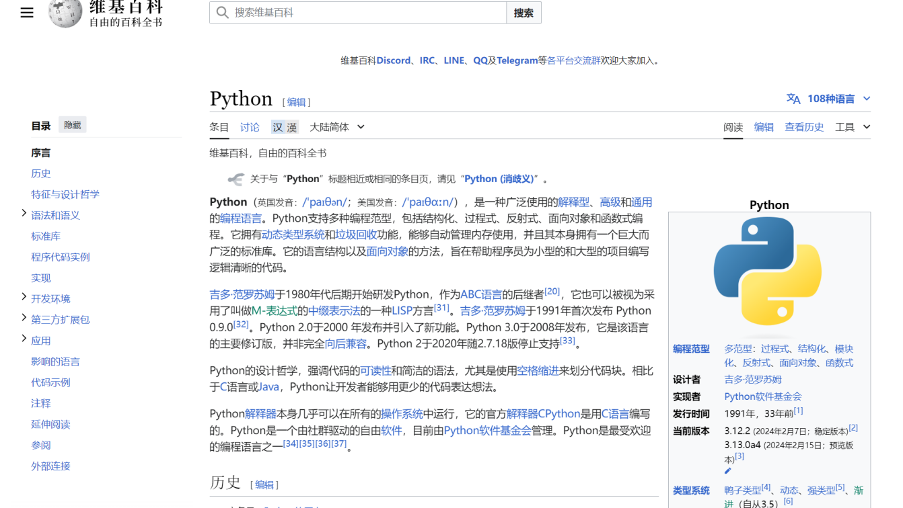

图2-1 Python

MySQL数据库

MySQL AB是一家基于MySQL开发人员的商业公司，它是一家使用了一种成功的商业模式来结合开源价值和方法论的第二代开源公司。MySQL是MySQL AB的注册商标。MySQL的SQL“结构化查询语言”。SQL是用于访问数据库的最常用标准化语言。MySQL软件采用了GPL（GNU通用公共许可证）。由于其体积小、速度快、总体拥有成本低，尤其是开放源码这一特点，许多中小型网站为了降低网站总体拥有成本而选择了MySQL作为网站数据库。

MySQL是一个快速的、多线程、多用户和健壮的SQL数据库服务器。MySQL服务器支持关键任务、重负载生产系统的使用，也可以将它嵌入到一个大配置(mass-deployed)的软件中去。

Scrapy

Scrapy框架作为Python爬虫的关键技术，是一个高级的网页爬取工具，能以特定的结构从目标网页中抓取数据，应用广泛，尤其在舆情监测、舆情分析中不可或缺。其中控系统为Engine（中心引擎），负责连接管道、下载器、爬虫和调度器，实现数据之间的传递与交流。为应对反爬虫机制，Scrapy框架提供了多种反爬策略，如设置User-Agent、使用代理IP、限制爬取速度等。调度器按预定方式对请求命令进行分类和排序，并将有序命令返回中心引擎，起到“加工车间”的作用。下载器负责将请求交付给网页并接收回应，爬虫从中提取有用数据并将下一步URL交付给中心引擎，实现自动化爬取。管道则对爬虫获取的Item进行处理，如数据清洗、存储等，同时可以在管道中加入反爬机制，如设置请求头、模拟人类行为等，以规避网站的反爬虫措施，提高爬取成功率。

Spring Boot

SpringBoot是一种流行的基于Java的框架，可简化健壮的、可用于生产的应用程序的开发。它构建在Spring框架之上，提供一系列可加速应用程序开发的功能。SpringBoot提供了简化的设置过程，需要最少的配置，并且包含嵌入式Web服务器，可以轻松创建Web应用程序。

SpringBoot的主要优势之一是它能够开箱即用地处理各种问题，包括安全性、数据库访问和依赖项管理。它促进微服务架构，促进模块化和可维护应用程序的开发。SpringBoot还提供了丰富的扩展和库生态系统（称为“启动器”），可简化与数据库、消息传递系统和云平台等技术的集成。

凭借其快速的开发能力和广泛的社区支持，SpringBoot已成为构建现代、可扩展且高效的Java应用程序的首选，如图2-2所示。

图2-2 Spring Boot

Spark SQL

SparkSQL是ApacheSpark生态系统的强大组件，它提供了用于查询结构化和半结构化数据的简化接口。它扩展了核心Spark引擎以支持SQL查询，从而可以更轻松地在分布式计算环境中处理结构化数据和非结构化数据。SparkSQL支持多种数据源，包括Hive、Parquet、JSON等，能够与现有数据存储系统无缝集成。

SparkSQL的主要功能包括执行SQL查询、数据帧操作以及在结构化和非结构化数据处理之间无缝切换的能力。它通过Catalyst查询优化和Tungsten执行引擎等技术优化查询执行，从而提高性能。此外，它还支持用户定义函数(UDF)并提供与JDBC和ODBC的兼容性，使其成为大数据应用程序中数据处理、分析和报告的多功能工具。

前端技术

Vue

Vue.js 是一款轻量级、高效且易于上手的 JavaScript 框架，用于构建用户界面和单页面应用。Vue 的核心特性包括声明式渲染、组件化、响应式数据绑定和虚拟 DOM，使得开发者能够更高效地构建可维护和可扩展的 Web 应用。Vue.js 支持插件系统和周边生态，例如 Vuex（状态管理）和 Vue Router（路由管理），进一步提升了其在复杂项目中的实用性。

Echarts

ECharts是一个开源的可视化库，用于创建交互式和可定制的数据可视化图表。它基于纯JavaScript，提供了丰富的图表类型，包括折线图、柱状图、饼图、散点图等，适用于各种数据展示需求。ECharts支持响应式设计，可在不同设备上无缝展示图表，并提供强大的交互功能，如数据缩放、拖拽、图例切换等。ECharts还提供了多语言支持和插件扩展机制，使开发者能够轻松创建出美观、交互丰富的数据可视化应用。无论是数据分析、数据报告还是数据监控，ECharts都是一个强大的工具。

本章小结

本章详细阐述了在系统构建中所采用的多项关键技术，包括Vue前端框架、Echarts数据可视化工具、SparkSQL数据处理技术、MySQL数据存储、Spring Boot后端框架以及Python编程语言等。这些技术的有机结合使得系统具备了强大的功能和性能，并为用户提供了优质的体验。

对这些技术的深入探讨和优化补充，使得系统的设计更加完善，功能更加丰富。将以上技术的巧妙整合，系统在性能、用户体验和功能上都达到了不错的水平。并且对技术的深入研究和优化不仅提高了系统的整体质量，也为以后的拓展和升级有着一定的帮助。

## 系统分析

可行性分析

技术可行性：从技术角度看，系统采用了现代的数据采集、存储和分析技术，包括Python爬虫、Spark SQL、MySQL数据库等。这些技术在实践中已得到广泛应用，具备成熟和稳定的特点，因此系统在技术上是可行的。此外，使用Spring Boot和Vue构建交互式数据展示系统也是合理的选择，这些技术有强大的社区支持，开发效率高，用户体验好。

经济可行性：从经济角度看，系统的开发和维护成本需要考虑。虽然采用了多种先进技术，但开源工具和框架的使用可以降低开发成本。重要的是，系统的预期收益需要超过开发和维护的成本，因此需要考虑用户订阅、广告收入等盈利模式。如果系统能够吸引足够的用户和广告商，从而实现良好的盈利，那么从经济上来说，它也是可行的。

法律可行性：在法律层面，系统需要遵守相关的法律法规，特别是涉及到用户数据的采集和处理。确保用户数据的隐私和安全是至关重要的。此外，需要考虑著作权法和知识产权法等法律，以确保在系统中使用的小说和数据没有侵犯他人的权利。合规性方面需要严格把关，以避免法律风险。

综合来看，从技术、经济和法律角度进行的可行性分析显示，该系统在现实中是可行的，但需要仔细考虑技术实施、经济盈利模式和法律合规性等方面的问题，以确保系统的成功运营和可持续发展。

业务需求分析

本系统旨在创建一个综合的大数据分析和处理平台，专注于纵横小说网的数据。系统的核心目标是以Python为主要开发语言，通过编写自动化爬虫程序，实现对纵横小说网上的所有数据的抓取和提取。这包括小说的简介内容、作者信息、榜单信息、读者评论数据等等。

因此本系统业务主要分为三大模块：数据爬取，清洗、存储，分析结果展示，为了保证本系统中所有数据的安全，系统中的分析结果查看，数据爬取，数据清洗等操作都需要用户登录后才可以使用，因此本系统的用例图如图3-1所示。

图3-1 用例图

功能需求分析

登录

用户在登录界面输入账号和密码进行登录，如果根据用户输入的个人信息校验通过则可以登录成功，反之如果校验没有通过则无法登录，然后可以重新输入信息进行登录操作。登录原型图如图3-2所示。

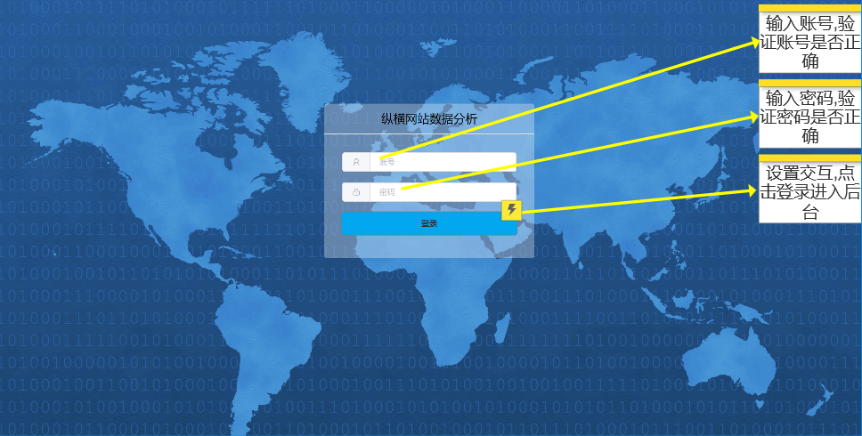

图3-2 登录原型图

登录按钮设置了交互，跳转页面到后台系统，登录界面需要简洁明了，让用户快速地理解并完成登录。输入框提示当前用户将要输入的内容，账号和密码，让用户有良好地体验。

实时爬取

数据爬取用例中，实时爬取共分为三大类：点击榜，推荐榜，月票榜，纵横小说网会对点击榜与推荐榜进行每天，每周，每月的更新，然后月票榜，纵横小说网每月会进行更新，因此系统需要每天，每月，每周自动对这些榜单数据进行实时爬取获取，用例描述如表3-1所示。

表3-1 实时爬取

<table>
<tr><td>名称</td><td colspan="2">实时爬取</td></tr>
<tr><td>概述</td><td colspan="2">实时爬取纵横小说网的数据</td></tr>
<tr><td>参与者</td><td colspan="2">无</td></tr>
<tr><td>前置条件</td><td colspan="2">需要提前准备好实时爬取的Python脚本</td></tr>
<tr><td>基本事件流</td><td>步骤</td><td>活动</td></tr>
<tr><td></td><td>1</td><td>启动系统</td></tr>
<tr><td></td><td>2</td><td>服务端启动定时任务</td></tr>
<tr><td></td><td>3</td><td>系统自动开始实时爬取任务</td></tr>
<tr><td></td><td>4</td><td>爬取到数据后，自动进行清洗与分析，并将结果存入数据库中。</td></tr>
</table>

实时爬取原型图如图3-3所示。

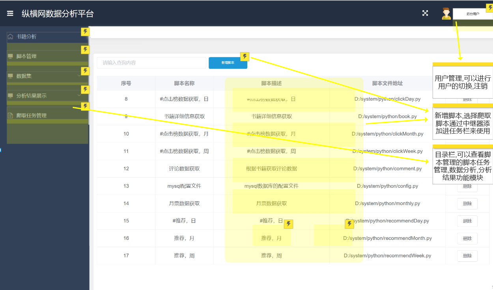

图3-3 实时爬取原型图

主要由左侧的目录栏，右侧的后台用户以及中间的脚本功能组成。目录栏运用了动态面板功能，数据集和分析结果展示都能展开;后台用户也是采用动态面板，可以进行用户的注销;新增脚本运用了中继器，可以进行脚本的添加，删除等操作，这里的脚本是指爬取数据爬取的哪些内容，比如说爬取每日的点击榜这是一个脚本，而爬取每月的点击榜是另外一个脚本。设计不同得脚本可以得到不同结果，与此同时上传脚本更加地带来了方便。

爬取任务管理

用户还可以手动开启爬取任务，爬取有关纵横小说网下的数据，比如爬取书籍信息书籍，爬取评论书籍等，并且可以在爬取任务用例中查看爬取的结果等，具体的用例描述与表3-2所示。

表3-2 爬取任务管理

<table>
<tr><td>名称</td><td colspan="2">爬取任务管理</td></tr>
<tr><td>概述</td><td colspan="2">创建纵横小说网爬取任务，并查看任务状态，进行手动执行任务，删除任务，修改任务等操作</td></tr>
<tr><td>参与者</td><td colspan="2">系统用户</td></tr>
<tr><td>前置条件</td><td colspan="2">提前创建好定时任务</td></tr>
<tr><td>基本事件流</td><td>步骤</td><td>活动</td></tr>
<tr><td></td><td>1</td><td>进入爬取任务列表</td></tr>
<tr><td></td><td>2</td><td>创建爬取任务，输入爬取的类型（对应不同的爬取脚本）。</td></tr>
<tr><td></td><td>3</td><td>系统启动后，到时间自动开启运行爬取任务</td></tr>
<tr><td></td><td>4</td><td>用户在任务列表查看任务执行状态与结果，并对任务进行修改，删除，手动执行等操作。</td></tr>
</table>

爬取任务管理原型图如图3-4所示。

图3-4 爬取任务管理原型图

新增任务也是运用了中继器，可以进行任务脚本的删除，开始等操作，这里能够看到历史记录，之前脚本的运行情况，开始时间，结束时间以及任务脚本执行是否成功。另外左侧的目录栏，右侧的后台用户与之前功能一样，都是后台系统共用的。脚本任务管理是特别方便去管控整个分析平台。

数据清洗

用户可以在本系统查看清洗后的爬取数据，如表3-3所示。

表3-3 数据清洗结果

<table>
<tr><td>名称</td><td colspan="2">数据清洗结果</td></tr>
<tr><td>概述</td><td colspan="2">登入系统的用户查看纵横小说网数据清洗后的结果，并可以对其进行分页，模糊查询</td></tr>
<tr><td>参与者</td><td colspan="2">系统用户</td></tr>
<tr><td>前置条件</td><td colspan="2">登入系统</td></tr>
<tr><td>基本事件流</td><td>步骤</td><td>活动</td></tr>
<tr><td></td><td>1</td><td>点击数据清洗结果按钮</td></tr>
<tr><td></td><td>2</td><td>查看清洗后的数据</td></tr>
<tr><td></td><td>3</td><td>点击分页，进行分页查询</td></tr>
<tr><td></td><td>4</td><td>输入查询字段，对其进行模糊查询</td></tr>
</table>

数据清洗原型图如图3-5所示。

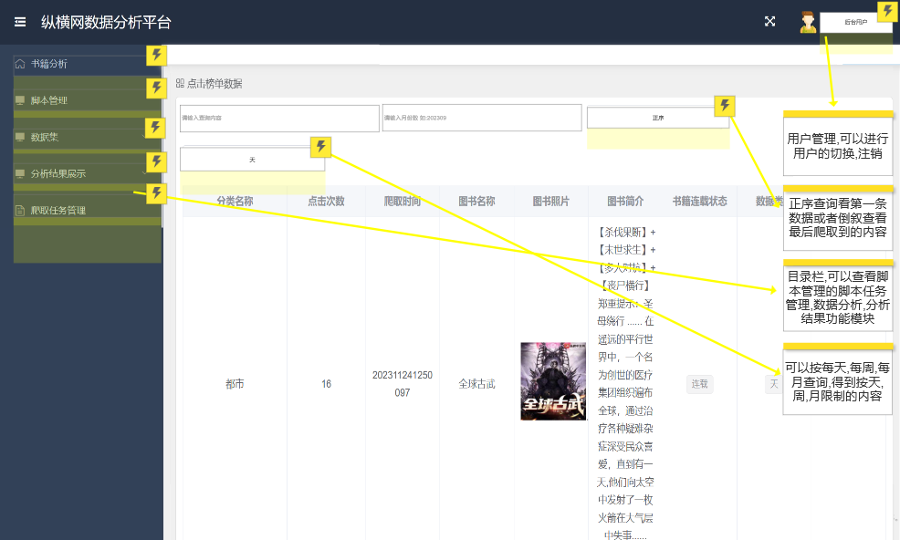

图3-5 数据清洗原型图

除了目录栏，后台用户之外，同样也用到了动态面板和中继器。查询可以按照每天，每周或者每月查询，同时也可以用正序或者倒叙进行筛选。中继器可以实现分页功能，表格可以装填处理得到的数据。通过筛选可以更好地看到结果反馈。

评论情感分析

系统用户通过登录系统，在选择书籍后，系统对书籍评论进行NLP情感分析，并以图形化方式展示积极、消极和中性评论，帮助用户了解读者的情感倾向，用例描述如表3-4所示。

表3-4评论情感分析

<table>
<tr><td>名称</td><td colspan="2">评论情感分析</td></tr>
<tr><td>概述</td><td colspan="2">通过对书籍的评论语句进行NLP情感分析，筛选出该书籍下积极，消极，中性评论，帮助用户更好的分析读者心路历程</td></tr>
<tr><td>参与者</td><td colspan="2">系统用户</td></tr>
<tr><td>前置条件</td><td colspan="2">登入系统</td></tr>
<tr><td>基本事件流</td><td>步骤</td><td>活动</td></tr>
<tr><td></td><td>1</td><td>用户登入系统</td></tr>
<tr><td></td><td>2</td><td>选择需要被分析的书籍</td></tr>
<tr><td></td><td>3</td><td>系统通过被选择的书籍，读取该书籍的部分评论数据，然后进行NLP分析</td></tr>
<tr><td></td><td>4</td><td>界面展示分析后的结果，并以词云图，饼状图等形式进行图形化展示</td></tr>
</table>

数据清洗原型图如图3-6所示。

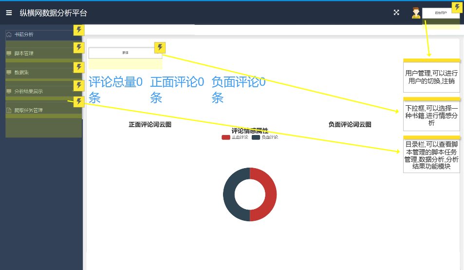

图3-6 评论情感分析原型图

除了目录栏，后台用户之外，这里有一个有关书籍的下拉框，点击下拉框可以选择一本书，然后情感分析就会展示效果图以及词云，这样可以有一个直接的对比，圆形图比例还有一个直观的感受。

书籍分析

系统用户登录系统，进行书籍分析，系统使用多线程的方式，结合爬取到的各种榜单数据（月票，推荐，点击），对书籍进行分析，展示最受欢迎的书籍，展示书籍字数与榜单之间的关系，如表3-5所示。

表3-5 书籍分析

<table>
<tr><td>名称</td><td colspan="2">书籍分析</td></tr>
<tr><td>概述</td><td colspan="2">系统选择综合排名前200的书籍，结合这些书籍对应的榜单数据与本身数据，进行分析</td></tr>
<tr><td>参与者</td><td colspan="2">系统用户</td></tr>
<tr><td>前置条件</td><td colspan="2">登入系统</td></tr>
<tr><td>基本事件流</td><td>步骤</td><td>活动</td></tr>
<tr><td></td><td>1</td><td>用户登入系统，选择书籍分析</td></tr>
<tr><td></td><td>2</td><td>系统使用多线程进行不同维度分析</td></tr>
<tr><td></td><td>3</td><td>返回分析结果</td></tr>
<tr><td></td><td>4</td><td>前端通过v-cahrts对分析结果进行可视化展示</td></tr>
</table>

书籍分析原型图如图3-7所示。

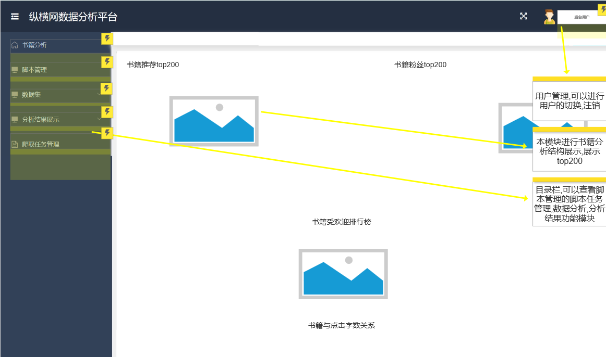

图3-7 书籍分析原型图

书籍分析结果会呈现top200由书籍名组成的色彩图，至于目录栏，后台用户都是跟之前一样的功能。

榜单数据分析

榜单数据分析，月票榜可以直观的展示，纵横中文网中最吸金的小说，因此可以对月票榜单数据进行横向分析，来展示趋势，如表3-6所示。

表3-6 榜单数据分析

<table>
<tr><td>名称</td><td colspan="2">榜单数据分析</td></tr>
<tr><td>概述</td><td colspan="2">首先展示月票榜前200的书籍词云图，然后用户点击词云图，展示该书籍的月票走势与点击，推荐饼状分析结果</td></tr>
<tr><td>参与者</td><td colspan="2">系统用户</td></tr>
<tr><td>前置条件</td><td colspan="2">登入系统</td></tr>
<tr><td>基本事件流</td><td>步骤</td><td>活动</td></tr>
<tr><td></td><td>1</td><td>登入系统</td></tr>
<tr><td></td><td>2</td><td>前端通过v-charts渲染展示前200名书籍词云</td></tr>
<tr><td></td><td>3</td><td>用户点击词语图中的词语，系统在对该书籍进行分析</td></tr>
<tr><td></td><td>4</td><td>展示分析后的月票走势结果，点击与推荐饼状图</td></tr>
</table>

榜单数据原型图如图3-8所示。

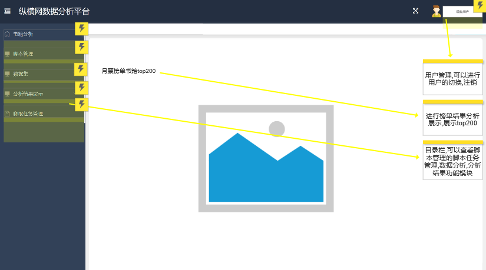

图3-8 榜单数据原型图

月票榜单书籍排行结果会呈现top200由书籍名组成的色彩图，同时目录栏，后台用户功能也是一样。

非功能需求分析

为了保障数据处理速度，数据爬取效率，系统能够及时收集纵横小说网最新最热数据，系统应该在性能上具有以下需求：

1.响应时间：系统应该能够在毫秒级别内对用户请求做出响应。

2.并发能力：系统应该支持大量的并发请求，以保证用户的访问不会受到限制。

3.数据处理速度：系统应该能够在实时处理大量的数据，以确保数据的及时更新。

本系统的核心业务：爬取纵横小说网数据，对纵横小说网数据进行分析，因此避免不了读者信息的捕获，因此本系统在安全上应该具有以下需求：

1.用户数据保护：系统应该保证用户隐私数据的保密性和完整性。

3.系统数据保护：系统应该采用多种安全技术，防止系统被黑客攻击，确保数据的安全性。

并且爬取的纵横小说网数据应该在法律的允许范围内进行爬取，并且严格保护被爬取的内容，保证用户隐私安全。

本章小结

本章节详细梳理了系统需要实现的功能，确保了目标的清晰性和可操作性。通过从技术、法律和经济三个关键角度进行可行性分析，系统设计的实施得到了全面评估，保证了系统的正常实现和投入使用。这一综合性分析为系统的可持续发展和顺利运行提供了坚实的基础和保障。这一章节的深入探讨不仅局限于功能需求的概述，更倾向于确保系统设计的全面性和可操作性。

通过多种关键角度的综合考量，系统的整个实施得到了充分的审核评估，进而为系统的顺利推进和长期运营打下了坚实的基础。这种综合性的分析不仅仅关注了系统本身的技术实现，而且涵盖了法律合规和经济可行性等多个方面，为系统在实践中的可持续性发展提供了全面的支撑和保障。

## 系统设计

系统总体设计

通过上述的需求分析得知，本系统分为四大类：登录，脚本管理，数据爬取，分析结果展示，系统功能结构图如图4-1所示。

图4-1 系统功能结构图

系统采用的架构为B/S架构，服务端由Spring Boot提供，Spring Boot 提供分析结果展示，数据爬取，脚本管理，登录等功能调用逻辑支撑与HTTP通信，Python提供数据爬取，清洗，分析等过程的实施逻辑，Vue提供界面，MySQL数据库提供数据持久化储存，系统的架构图如图4.2所示。

图4-2 系统架构图

主要功能设计

登录

系统管理员用户输入账号与密码进行系统登录，系统服务端对密码进行MD5签名，通过SQL语句对数据库用户表进行条件查询，账号与签名后的密码为条件，对查询的结果进行判断，看是否为Null，如果为Null代表账号或者密码错误，提示用户登录失败，如果不为Null则登录成功，系统通过JWT算法生成Token，与登录后的用户信息一起返回给前端，提示登录成功，时序图如图4-3所示，通过时序图可以看出本系统需要具有用户实体类，且具有账号与密码成员变量。

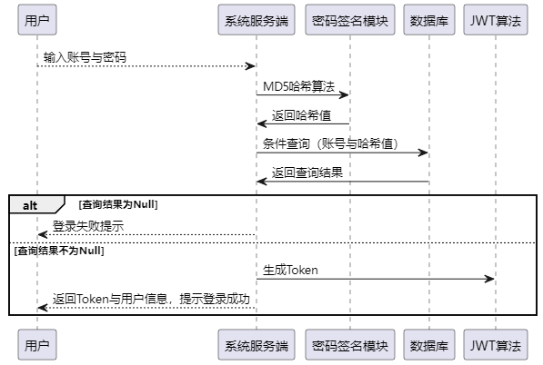

图4-3 登录时序图

脚本管理

成功登入系统的用户可以上传Python脚本，输入脚本的名字，脚本的介绍，服务端保存脚本文件，并将地址与用户输入的信息存入数据库脚本表中，系统管理员同样可以对脚本信息进行查询，然后删除或者更新脚本内容，如果是删除操作，服务端对数据库执行删除语句，如果是更新操作且传入了新的脚本，服务端上传脚本后，对数据库执行更新语句，时序图如图4-4所示，因此本系统需要具有脚本实体类，且该类具有主键，脚本名字，脚本地址，脚本介绍成员变量。

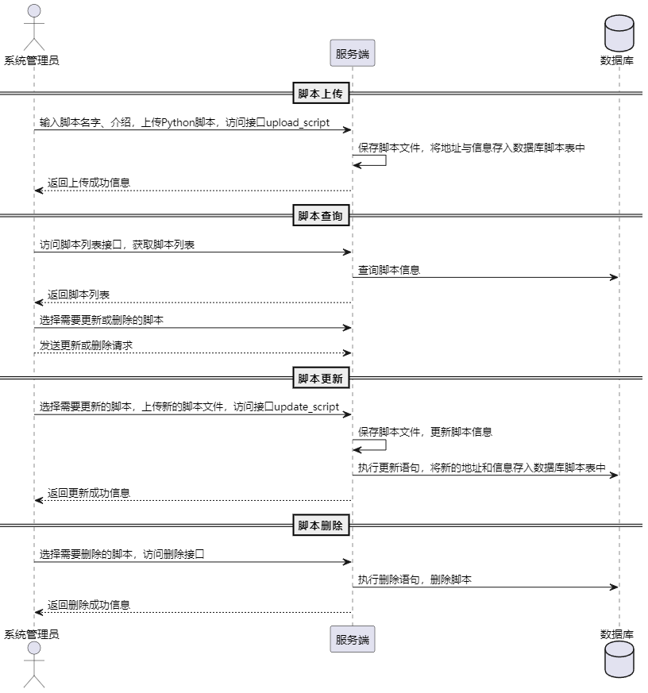

图4-4 脚本管理时序图

爬取任务管理

根据详细的需求分析，系统具备实时爬取和定时爬取的功能。用户可以创建定时爬取任务，灵活设定爬取的周期和类型，每种类型对应不同的Python脚本，确保适用性和多样性。创建成功后，任务初始状态为未运行，用户可以手动触发任务执行，或者等待系统按照设定的周期自动运行。任务运行后，系统会在任务运行表中生成一条记录，包含任务的相关数据和状态，包括开始、成功或失败状态，若任务失败，系统还会记录失败的具体原因，以方便问题排查和改进。此外，用户可以随时在爬取任务中进行查询、修改和删除操作，以满足不同的需求和变化。系统致力于提供灵活性、可维护性和可管理性，确保用户能够高效地管理和运行爬取任务，实现数据的定期获取和分析，满足各种应用场景的需求，这功能的灵活性使用户能够根据需求轻松地创建、管理和运行不同类型的爬取任务，确保数据获取的多样性。用户可以根据任务的执行情况，实时查看任务状态，随时调整和优化任务，确保数据的高质量和及时性。系统的自动化运行也减轻了用户的负担，不必手动干预每次运行，而是可依赖系统的自动调度。同时，详细记录任务的执行状态和失败原因，帮助用户了解任务的历史表现，进一步提高数据采集的效率和可靠性。这一综合性的任务管理系统有助于满足不同用户的数据获取需求，无论是日常数据更新、分析，还是特定时间段的数据提取，时序图如图4-5所示。

图4-5 爬取任务管理

Java执行Python代码

通过taskService获取任务信息，设置任务的开始时间，通过scriptService获取与任务相关的脚本信息，创建一个Python进程，用于执行脚本，通过读取进程的标准输出，获取执行过程中的输出信息，逐行打印到控制台，同样，通过读取进程的错误输出，获取错误信息，逐行打印到控制台，并将错误信息存储在任务对象中，等待Python进程执行完成，阻塞方法，直到进程执行完毕。根据进程的退出码，判断任务执行是否成功，如果退出码为0，任务标记为成功；否则，标记为失败，设置任务的结束时间，使用taskService更新任务信息，时序图如图4-6所示。

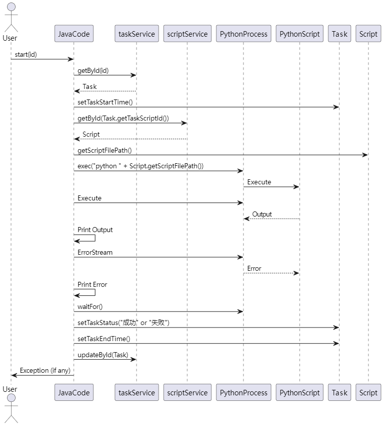

图4-6 Java执行Python脚本

数据爬取

本系统有多个数据爬取的Python脚本，主要爬取的方式有两种：第一种直接请求接口，获取接口返回的数据，然后存入DB中，第二种需要使用BeautifulSoup框架分析返回的页面，读取HTML与Class属性，获取其中的字段值，然后存入DB中。因此这里主要以书籍信息爬取（接口返回的数据为HTML页面），月票信息数据（接口直接返回的数据）为例，进行数据爬取设计。

主函数（Main）从数据库（DB）获取书籍的ID和描述。对于每本书籍，主函数创建一个线程并执行get_book_details函数（GetBookDetails）。get_book_details函数构建URL并发起HTTP请求（HTTPRequest）。HTTP请求的响应被接收并通过HTML解析器（HTMLParser）解析。解析后的数据返回给get_book_details函数。get_book_details函数将数据保存到数据库（DataSave），时序图如图4-7所示。

图4-7 书籍信息获取时序图

主函数（Main）获取当前的时间和年份。对每个月份，主函数创建一个线程来执行fetch_data函数。fetch_data函数发送带有查询参数的POST请求。接收到的HTTP响应数据被返回给fetch_data函数。fetch_data函数处理和格式化数据。处理后的数据被保存到数据库，时序图如图4-8所示。

图4-8 月票数据获取

数据分析

情感分析时序图如图4-9所示，Spark Session 初始化: 初始化 SparkSession 以连接Spark集群，从数据库读取数据: 使用Spark的JDBC接口读取数据库中的评论数据，数据过滤和选择: 基于 bookId 过滤评论，并选择需要的列（content， nickName， createTime， ipRegion），数据清洗: 对评论内容进行清洗，移除HTML标签，情感分析: 对清洗后的评论内容应用情感分析，使用了阿里云的NLP服务，让情感分析的结果更加精确，情感分析结果处理: 创建 SentimentRow 对象来存储分析结果，并加入结果列表，返回结果: 返回包含情感分析结果的数据集。

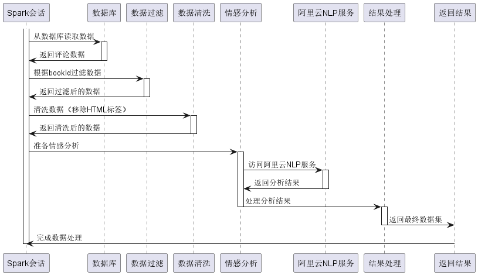

图4-9 情感分析时序图

书籍分析时序图如图4-10所示，客户端调用BookAnalysis方法，该方法首先创建一个含四个线程的线程池，然后异步提交四个任务到booksMapper，分别获取基于粉丝数、关键词数、推荐算法的Top图书数据以及所有Top图书的综合数据，每个任务返回一个Future对象。方法同步等待所有Future结果，处理这些数据，创建两种图表对象line和lines，在完成所有任务后关闭线程池，最终构建并返回一个包含所有分析数据的BookAnalysis对象给前端，前端在通过这些数据进行书籍分析可视化展示。

图4-10 书籍分析时序图

榜单分析时序图如图4-11所示 ，使用monthMapper.monthsLine(bookId)查询获取指定书籍的月份排名数据，结果映射到BookAnalysis.WordCloud对象的列表，提取月份名称和对应的排名值，使用monthMapper.clicksPie(bookId)查询根据天、周、月分类的点击数据，结果同样映射到BookAnalysis.WordCloud对象的列表。使用monthMapper.recommondsPie(bookId)查询根据天、周、月分类的推荐数据。结果也映射到BookAnalysis.WordCloud对象的列表，最后，方法创建一个BookAnalysis对象，其中包含月份排名线图（line），点击数据饼图（clicks），推荐数据饼图（recommonds），然后返回这个对象。

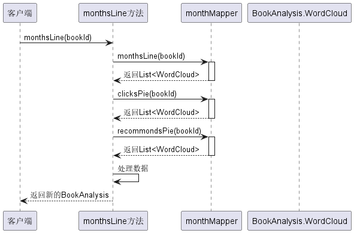

图4-11 类别分析时序图

数据库设计

数据库表设计

通过4.2章节功能设计得知，本系统共有8张表，用户表存储账号密码数据，实现用户登录功能；任务表存储Python脚本数据，实现数据爬取，数据分析等功能；脚本表存储Python脚本，方便Java调用Python脚本；书籍表存储该书籍的总点击数，总字数等；点击表存储着年，月，日的点击数据；评论表存储着所有来自纵横中文网的评论数据；月票表存储着来自纵横中文网的月票榜单数据；推荐表存储着纵横中文网每周，每天，每月的推荐数据，系统通过这些表中的数据实现情感分析，书籍分析等功能。

用户表结构如表4-1所示，用户表主要字段为username与password，该字段存储着用户的登录账号与密码，方便系统服务端对用户输入的数据进行判断，来验证该用户是否为系统用户。

表4-1 用户表

<table>
<tr><td>字段名</td><td>数据类型</td><td>主键/允许空</td><td>字段含义</td></tr>
<tr><td>user_id</td><td>int</td><td>PRIMARY KEY</td><td>用户表主键</td></tr>
<tr><td>username</td><td>varchar</td><td>不允许</td><td>登录账号</td></tr>
<tr><td>password</td><td>varchar</td><td>不允许</td><td>登录密码</td></tr>
</table>

任务表结构如表4-2所示，任务表主要存储着本系统所有数据爬取或者数据分析任务，主要字段为task_script_id，该字段关联脚本表，系统通过该字段获取脚本位置，以此来运行Python脚本。

表4-2 任务表

<table>
<tr><td>字段名</td><td>数据类型</td><td>主键/允许空</td><td>字段含义</td></tr>
<tr><td>info</td><td>varchar(255)</td><td>NULL</td><td>执行信息</td></tr>
<tr><td>task_end_time</td><td>datetime</td><td>NULL</td><td>结束时间</td></tr>
<tr><td>task_id</td><td>int</td><td>PRIMARY KEY</td><td>主键</td></tr>
<tr><td>task_name</td><td>text</td><td>NULL</td><td>任务名称</td></tr>
<tr><td>task_script_id</td><td>int</td><td>NULL</td><td>脚本信息</td></tr>
<tr><td>task_start_time</td><td>datetime</td><td>NULL</td><td>开始时间</td></tr>
<tr><td>task_status</td><td>varchar(255)</td><td>NULL</td><td>状态</td></tr>
</table>

脚本表结构如表4-3所示，脚本表主要存储着本系统所有Python脚本数据信息，重要字段为script_file_path表示脚本在系统中的路径。

表4-3 脚本表

<table>
<tr><td>字段名</td><td>数据类型</td><td>主键/允许空</td><td>字段含义</td></tr>
<tr><td>script_description</td><td>text</td><td>NULL</td><td>脚本解释</td></tr>
<tr><td>script_file_path</td><td>text</td><td>NULL</td><td>脚本实际位置</td></tr>
<tr><td>script_id</td><td>int</td><td>PRIMARY KEY</td><td>脚本id</td></tr>
<tr><td>script_name</td><td>text</td><td>NULL</td><td>脚本名称</td></tr>
</table>

推荐表如表4-4所示，存储着所有来自纵横中文网的书籍推荐数据，其中type字段表示了数据的来自区间（天推荐，周推荐，月推荐），isPython是系统生成的唯一字段也是主键，bookId关联了书籍表。

表4-4 推荐表

<table>
<tr><td>字段名</td><td>数据类型</td><td>主键/允许空</td><td>字段含义</td></tr>
<tr><td>authorCover</td><td>text</td><td>NULL</td><td>作者的头像，字符串类型，可为空</td></tr>
<tr><td>authorId</td><td>int</td><td>NOT NULL</td><td>作者的id，整数类型，主键，不可为空</td></tr>
<tr><td>bookCover</td><td>text</td><td>NOT NULL</td><td>书籍的封面，字符串类型，不可为空</td></tr>
<tr><td>bookId</td><td>int</td><td>NOT NULL</td><td>书籍的id，整数类型，主键，不可为空</td></tr>
<tr><td>bookName</td><td>text</td><td>NOT NULL</td><td>书籍的名称，字符串类型，不可为空</td></tr>
<tr><td>cateFineId</td><td>int</td><td>NOT NULL</td><td>书籍的细分类别的id，整数类型，不可为空</td></tr>
<tr><td>cateFineName</td><td>text</td><td>NOT NULL</td><td>书籍的细分类别的名称，字符串类型，不可为空</td></tr>
<tr><td>description</td><td>text</td><td>NOT NULL</td><td>书籍的简介，字符串类型，不可为空</td></tr>
<tr><td>isFavorite</td><td>tinyint(1)</td><td>NOT NULL</td><td>书籍是否被收藏，布尔类型，不可为空</td></tr>
<tr><td>isPython</td><td>varchar(50)</td><td>PRIMARY KEY</td><td>唯一标识</td></tr>
<tr><td>latestChapterId</td><td>int</td><td>NOT NULL</td><td>书籍的最新章节id，整数类型，不可为空</td></tr>
<tr><td>latestChapterName</td><td>text</td><td>NOT NULL</td><td>书籍的最新章节名称，字符串类型，不可为空</td></tr>
<tr><td>latestChapterTime</td><td>text</td><td>NOT NULL</td><td>书籍的最新章节更新时间，字符串类型，不可为空</td></tr>
<tr><td>number</td><td>int</td><td>NOT NULL</td><td>书籍的阅读量，整数类型，不可为空</td></tr>
<tr><td>orderNo</td><td>int</td><td>NOT NULL</td><td>书籍的排序号，整数类型，不可为空</td></tr>
<tr><td>pseudonym</td><td>text</td><td>NOT NULL</td><td>作者的笔名，字符串类型，不可为空</td></tr>
<tr><td>rankNo</td><td>text</td><td>NULL</td><td>书籍的排名，字符串类型，可为空</td></tr>
<tr><td>reward</td><td>int</td><td>NOT NULL</td><td>书籍的打赏金额，整数类型，不可为空</td></tr>
<tr><td>rewardStr</td><td>text</td><td>NULL</td><td>书籍的打赏字符串，字符串类型，可为空</td></tr>
<tr><td>rewardType</td><td>int</td><td>NOT NULL</td><td>书籍的打赏类型，整数类型，不可为空</td></tr>
<tr><td>serialStatus</td><td>int</td><td>NOT NULL</td><td>书籍的连载状态，整数类型，不可为空</td></tr>
<tr><td>type</td><td>int</td><td>NOT NULL</td><td>0天1周2月</td></tr>
<tr><td>updownNumber</td><td>int</td><td>NOT NULL</td><td>书籍的上下架状态，整数类型，不可为空</td></tr>
</table>

月票表结构如表4-5所示，存储着所有纵横中文网的月票数据，系统可以根据这些数据进行书籍分析，读者爱好分析等，bookId字段关联了书籍表。

表4-5 月票表

<table>
<tr><td>字段名</td><td>数据类型</td><td>主键/允许空</td><td>字段含义</td></tr>
<tr><td>authorCover</td><td>varchar(200)</td><td>NULL</td><td>作者的头像图片地址</td></tr>
<tr><td>authorId</td><td>int</td><td>NULL</td><td>作者的 ID</td></tr>
<tr><td>bookCover</td><td>varchar(200)</td><td>NULL</td><td>书籍的封面图片地址</td></tr>
<tr><td>bookId</td><td>int</td><td>NULL</td><td>书籍的 ID</td></tr>
<tr><td>bookName</td><td>varchar(50)</td><td>NULL</td><td>书籍的名称</td></tr>
<tr><td>cateFineId</td><td>int</td><td>NULL</td><td>书籍的细分类别 ID</td></tr>
<tr><td>cateFineName</td><td>varchar(20)</td><td>NULL</td><td>书籍的细分类别名称</td></tr>
<tr><td>description</td><td>varchar(500)</td><td>NULL</td><td>书籍的简介</td></tr>
<tr><td>is_python</td><td>varchar(20)</td><td>PRIMARY KEY</td><td>书籍的爬虫标识</td></tr>
<tr><td>isFavorite</td><td>tinyint(1)</td><td>NULL</td><td>书籍是否被收藏</td></tr>
<tr><td>latestChapterId</td><td>int</td><td>NULL</td><td>书籍的最新章节 ID</td></tr>
<tr><td>latestChapterName</td><td>varchar(50)</td><td>NULL</td><td>书籍的最新章节名称</td></tr>
<tr><td>latestChapterTime</td><td>varchar(20)</td><td>NULL</td><td>书籍的最新章节更新时间</td></tr>
<tr><td>number</td><td>int</td><td>NULL</td><td>月票数</td></tr>
<tr><td>orderNo</td><td>int</td><td>NULL</td><td>排序</td></tr>
<tr><td>pseudonym</td><td>varchar(20)</td><td>NULL</td><td>作者的笔名</td></tr>
<tr><td>rankNo</td><td>varchar(20)</td><td>NOT NULL</td><td>爬取的月票年份与月份</td></tr>
<tr><td>reward</td><td>int</td><td>NULL</td><td>奖励</td></tr>
<tr><td>rewardStr</td><td>varchar(20)</td><td>NULL</td><td>奖励说明</td></tr>
<tr><td>rewardType</td><td>int</td><td>NULL</td><td>奖励类型</td></tr>
<tr><td>serialStatus</td><td>int</td><td>NULL</td><td>书籍的连载状态</td></tr>
<tr><td>updownNumber</td><td>int</td><td>NULL</td><td>书籍的上下架状态</td></tr>
</table>

评论表如表4-6所示，里面存储着所有评论数据，系统可以根据这些数据，进行地域分析，书籍评论情感分析，帮助用户掌握读者心理走向。

表4-6 评论表

<table>
<tr><td>字段名</td><td>数据类型</td><td>主键/允许空</td><td>字段含义</td></tr>
<tr><td>authorStatus</td><td>int</td><td>NOT NULL1</td><td>作者的状态</td></tr>
<tr><td>beRefPost</td><td>varchar(500)</td><td>NULL</td><td>评论的被引用评论</td></tr>
<tr><td>beRepliedNickName</td><td>varchar(20)</td><td>NULL</td><td>评论的被回复用户昵称</td></tr>
<tr><td>beRepliedUserId</td><td>int</td><td>NOT NULL</td><td>评论的被回复用户ID</td></tr>
<tr><td>bookId</td><td>int</td><td>NULL</td><td>评论的书籍</td></tr>
<tr><td>checkStatus</td><td>int</td><td>NOT NULL</td><td>评论的审核状态</td></tr>
<tr><td>content</td><td>text</td><td>NOT NULL</td><td>评论的内容</td></tr>
<tr><td>contentType</td><td>int</td><td>NOT NULL</td><td>评论的内容类型</td></tr>
<tr><td>createTime</td><td>bigint</td><td>NOT NULL</td><td>评论的创建时间</td></tr>
<tr><td>donateUnit</td><td>int</td><td>NOT NULL</td><td>评论的打赏单位</td></tr>
<tr><td>fansScoreLevel</td><td>int</td><td>NOT NULL</td><td>用户的粉丝评分等级</td></tr>
<tr><td>forumLeaderStatus</td><td>int</td><td>NOT NULL</td><td>用户的论坛领导者状态</td></tr>
<tr><td>forumsId</td><td>int</td><td>NOT NULL</td><td>论坛的ID</td></tr>
<tr><td>heatIgnore</td><td>int</td><td>NOT NULL</td><td>评论的热度忽略</td></tr>
<tr><td>heatNumber</td><td>int</td><td>NOT NULL</td><td>评论的热度数</td></tr>
<tr><td>heatNumMark</td><td>bigint</td><td>NOT NULL</td><td>评论的热度标记</td></tr>
<tr><td>imageUrl</td><td>text</td><td>NULL</td><td>评论的图片地址</td></tr>
<tr><td>includeThreadList</td><td>varchar(200)</td><td>NULL</td><td>评论的包含帖子列表</td></tr>
<tr><td>ipRegion</td><td>varchar(20)</td><td>NOT NULL</td><td>用户的IP地区</td></tr>
<tr><td>isClickSupport</td><td>int</td><td>NOT NULL</td><td>用户是否点击支持</td></tr>
<tr><td>lastPostTime</td><td>bigint</td><td>NOT NULL</td><td>评论的最后回复时间</td></tr>
<tr><td>lockStatus</td><td>int</td><td>NOT NULL</td><td>评论的锁定状态</td></tr>
<tr><td>markRed</td><td>tinyint(1)</td><td>NOT NULL</td><td>评论是否标红</td></tr>
<tr><td>mentionedNickNames</td><td>varchar(200)</td><td>NULL</td><td>评论的提及用户昵称</td></tr>
<tr><td>mentionedUsers</td><td>varchar(200)</td><td>NULL</td><td>评论的提及用户</td></tr>
<tr><td>nickName</td><td>varchar(20)</td><td>NOT NULL</td><td>用户的昵称</td></tr>
<tr><td>opStatus</td><td>int</td><td>NOT NULL</td><td>评论的操作状态</td></tr>
<tr><td>orderNum</td><td>int</td><td>NOT NULL</td><td>评论的排序号</td></tr>
<tr><td>postNum</td><td>int</td><td>NOT NULL</td><td>评论的回复数</td></tr>
<tr><td>redPacketId</td><td>int</td><td>NOT NULL</td><td>评论的红包ID</td></tr>
<tr><td>refChapterContent</td><td>varchar(500)</td><td>NULL</td><td>评论的引用章节内容</td></tr>
<tr><td>refChapterName</td><td>varchar(50)</td><td>NULL</td><td>评论的引用章节名称</td></tr>
<tr><td>refPostId</td><td>int</td><td>NOT NULL</td><td>评论的引用评论ID</td></tr>
<tr><td>refThreadId</td><td>int</td><td>NOT NULL</td><td>评论的引用帖子ID</td></tr>
<tr><td>replyPostParentId</td><td>int</td><td>NOT NULL</td><td>评论的回复父评论ID</td></tr>
<tr><td>rpList</td><td>varchar(500)</td><td>NULL</td><td>评论的回复列表</td></tr>
<tr><td>rsuv</td><td>int</td><td>NOT NULL</td><td>评论的rsuv值</td></tr>
<tr><td>scoreLevelNickName</td><td>varchar(20)</td><td>NOT NULL</td><td>用户的评分等级昵称</td></tr>
<tr><td>speakForbid</td><td>tinyint(1)</td><td>NOT NULL</td><td>用户是否被禁言</td></tr>
<tr><td>sticky</td><td>int</td><td>NOT NULL</td><td>评论是否置顶</td></tr>
<tr><td>threadDonateType</td><td>int</td><td>NOT NULL</td><td>评论的帖子打赏类型</td></tr>
<tr><td>threadId</td><td>int</td><td>NOT NULL</td><td>帖子的ID</td></tr>
<tr><td>title</td><td>varchar(100)</td><td>NULL</td><td>评论的标题</td></tr>
<tr><td>trendIds</td><td>varchar(200)</td><td>NULL</td><td>评论的趋势ID</td></tr>
<tr><td>trendViews</td><td>varchar(500)</td><td>NULL</td><td>评论的趋势视图</td></tr>
<tr><td>type</td><td>int</td><td>NOT NULL</td><td>评论的类型</td></tr>
<tr><td>upvoteNum</td><td>int</td><td>NOT NULL</td><td>评论的点赞数</td></tr>
<tr><td>userId</td><td>int</td><td>NOT NULL</td><td>用户的ID</td></tr>
<tr><td>userImgUrl</td><td>varchar(200)</td><td>NOT NULL</td><td>用户的头像地址</td></tr>
<tr><td>userLevel</td><td>int</td><td>NOT NULL</td><td>用户的等级</td></tr>
</table>

点击表如表4-7所示，点击表存储收集纵横中文网的点击数据，这些数据可以帮助分析用户的读书爱好等。

表4-7 点击表

<table>
<tr><td>字段名</td><td>数据类型</td><td>主键/允许空</td><td>字段含义</td></tr>
<tr><td>authorCover</td><td>text</td><td>NULL</td><td>作者的头像，字符串类型，可为空</td></tr>
<tr><td>authorId</td><td>int</td><td>NOT NULL</td><td>作者的id，整数类型，不可为空</td></tr>
<tr><td>bookCover</td><td>text</td><td>NOT NULL</td><td>书籍的封面，字符串类型，不可为空</td></tr>
<tr><td>bookId</td><td>int</td><td>NOT NULL</td><td>书籍的id，整数类型，主键，不可为空</td></tr>
<tr><td>bookName</td><td>text</td><td>NOT NULL</td><td>书籍的名称，字符串类型，不可为空</td></tr>
<tr><td>cateFineId</td><td>int</td><td>NOT NULL</td><td>书籍的细分类别的id，整数类型，不可为空</td></tr>
<tr><td>cateFineName</td><td>text</td><td>NOT NULL</td><td>书籍的细分类别的名称，字符串类型</td></tr>
<tr><td>description</td><td>text</td><td>NOT NULL</td><td>书籍的简介，字符串类型，不可为空</td></tr>
<tr><td>isFavorite</td><td>tinyint(1)</td><td>NOT NULL</td><td>书籍是否被收藏，布尔类型，不可为空</td></tr>
<tr><td>isPython</td><td>varchar(50)</td><td>PRIMARY KEY</td><td>书籍的爬取标识</td></tr>
<tr><td>latestChapterId</td><td>int</td><td>NOT NULL</td><td>书籍的最新章节id，整数类型，不可为空</td></tr>
<tr><td>latestChapterName</td><td>text</td><td>NOT NULL</td><td>书籍的最新章节名称，字符串类型，不可为空</td></tr>
<tr><td>latestChapterTime</td><td>text</td><td>NOT NULL</td><td>书籍的最新章节更新时间，字符串类型，不可为空</td></tr>
<tr><td>number</td><td>int</td><td>NOT NULL</td><td>排名的数量</td></tr>
<tr><td>orderNo</td><td>int</td><td>NOT NULL</td><td>书籍的排序号，整数类型，不可为空</td></tr>
<tr><td>pseudonym</td><td>text</td><td>NOT NULL</td><td>作者的笔名，字符串类型，不可为空</td></tr>
<tr><td>rankNo</td><td>text</td><td>NULL</td><td>书籍的排名，字符串类型，可为空</td></tr>
<tr><td>reward</td><td>int</td><td>NOT NULL</td><td>书籍的打赏金额，整数类型，不可为空</td></tr>
<tr><td>rewardStr</td><td>text</td><td>NULL</td><td>书籍的打赏字符串，字符串类型，可为空</td></tr>
<tr><td>rewardType</td><td>int</td><td>NOT NULL</td><td>书籍的打赏类型，整数类型，不可为空</td></tr>
<tr><td>serialStatus</td><td>int</td><td>NOT NULL</td><td>书籍的连载状态，整数类型，不可为空</td></tr>
<tr><td>type</td><td>int</td><td>NOT NULL</td><td>0天1周2月</td></tr>
<tr><td>updownNumber</td><td>int</td><td>NOT NULL</td><td>书籍的上下架状态，整数类型，不可为空</td></tr>
</table>

书籍表如表4-8所示，书籍表主要存储着书籍的基本信息，并且与点击表，评论表，月票表，推荐表有一对多的关联关系。

表4-8 书籍表

<table>
<tr><td>字段名</td><td>数据类型</td><td>主键/允许空</td><td>字段含义</td></tr>
<tr><td>arthur</td><td>varchar(255)</td><td>NOT NULL</td><td>作者</td></tr>
<tr><td>bookId</td><td>int</td><td>PRIMARY KEY</td><td>书籍id唯一</td></tr>
<tr><td>bookName</td><td>varchar(255)</td><td>NOT NULL</td><td>作品名称</td></tr>
<tr><td>bookType</td><td>varchar(255)</td><td>NOT NULL</td><td>作品类型</td></tr>
<tr><td>descinfo</td><td>text</td><td>NOT NULL</td><td>作品介绍</td></tr>
<tr><td>fans</td><td>int</td><td>NOT NULL</td><td>总粉丝数</td></tr>
<tr><td>link</td><td>varchar(255)</td><td>NOT NULL</td><td>地址</td></tr>
<tr><td>pic</td><td>varchar(255)</td><td>NOT NULL</td><td>作品封面</td></tr>
<tr><td>status</td><td>varchar(255)</td><td>NOT NULL</td><td>状态</td></tr>
<tr><td>totalclick</td><td>varchar(50)</td><td>NOT NULL</td><td>总点击数</td></tr>
<tr><td>totalrecommend</td><td>varchar(50)</td><td>NOT NULL</td><td>总推荐数</td></tr>
<tr><td>weekrecommend</td><td>varchar(50)</td><td>NOT NULL</td><td>周推荐</td></tr>
<tr><td>words</td><td>varchar(50)</td><td>NOT NULL</td><td>总字数</td></tr>
</table>

E-R图

根据上述章节设计得知，系统共包含8个主要实体：用户、任务、脚本、推荐、月票、评论、书籍和点击。这些实体构成了系统的数据层面，为系统的功能和数据管理提供了基础。

在系统中，脚本实体与任务实体之间存在一对多的关系。这意味着一个任务可以与一个脚本关联，而一个脚本可以同时被多个任务引用。这种关系设计使系统能够更有效地执行各种任务所需的脚本，提高系统的灵活性和可扩展性。

此外，系统中的书籍实体与月票、点击、评论和推荐数据相关联。这表示一个书籍可以对应多个月票、点击、评论和推荐数据。系统可以根据这些数据来查询和分析特定书籍的信息，从而实现不同维度的数据分析和洞察，系统的数据库E-R图如图4-12所示。

图4-12 数据库E-R实体关系图

本章小结

本章主要对系统进行了总体设计。首先，通过使用Visio工具绘制了功能结构图与功能架构图，明确了系统的功能体系。这有助于我们清晰地了解系统的各项功能，并为后续开发工作提供了清晰的指导。

接着，使用PlantUml对系统主要功能进行了设计，并绘制了主要功能的时序图。通过这一步骤，我们详细规划了系统各功能之间的交互流程和时序关系，有助于我们深入理解系统的运作机制，同时也为开发人员提供了实现功能的具体指引。

最后，对系统进行了数据库设计，确定了数据库表结构和表与表之间的关系。这一步骤是为了确保系统的数据存储和管理具有良好的结构和关联性，从而支持系统的各项功能正常运行。通过这些设计工作，系统的整体架构得到了完善和优化，为后续的开发和实施工作奠定了坚实的基础。

## 系统实现

登录实现

功能概述

系统通过使用 Form 表单和 el-form 组件构建，以及 el-input 组件构建输入框。用户输入账号和密码后，点击登录按钮，前端触发 submitForm 事件，向后端发起 login 请求。后端通过 userService 的 getOne 方法查询数据库，使用 MD5 加密密码，并生成 JWT。异常由 @RestControllerAdvice 和 @ExceptionHandler 拦截并返回给前端。

关键代码

关键代码如代码5-1所示，该代码接收包含用户名和密码的用户对象，通过用户名和密码查询数据库获取用户信息，若验证成功则返回用户登录信息和使用JWT工具类生成的令牌；若验证失败则抛出 ResultException 异常，并提示错误信息。

代码51 登录

<table>
<tr><td>public UserLoginDto userLoginDto(@RequestBody User admin) throws ResultException { User adminInfo = userService.getOne(new QueryWrapper&lt;User&gt;().eq(&quot;username&quot;， admin.getUsername()).eq(&quot;password&quot;， MD5Util.getMD5(admin.getPassword()))); if (adminInfo == null) { throw new ResultException(ResultStatus.ERROR_NUM_PWD); } else { return new UserLoginDto(adminInfo， JwtUtil.sign(adminInfo.getUsername()， adminInfo.getPassword())); } }</td></tr>
</table>

效果展示

图5-1 系统登录界面

脚本管理

功能概述

后台用户登录成功后，系统允许用户请求脚本列表，通过传入分页查询参数，服务端构造查询条件进行分页查询，将结果返回给前端，前端使用 el-table 组件进行渲染展示。用户可以点击添加按钮，在弹出的表单中选择文件并提交，系统将文件上传到指定位置，然后将脚本信息存入数据库中。

关键代码

关键代码如代码5-2所示，改代码是一个文件上传代码，是一个 POST 请求的处理器方法，用于处理文件上传操作。首先，通过 @RequestParam 注解接收名为 "file" 的 MultipartFile 类型参数，表示上传的文件。接着，从上传文件中获取原始文件名，然后根据当前时间生成新的文件名，以确保文件名的唯一性。接下来，将文件保存到指定的路径中，路径由 filePath 和新的文件名组成。然后，尝试将上传的文件保存到指定路径中，并返回保存的文件路径。如果保存过程中发生 IOException 异常，则将其捕获并抛出异常，异常信息包含了具体的错误原因。

代码52 脚本管理

<table>
<tr><td>@PostMapping(&quot;/upload&quot;) @ResponseBody public Result uploadImgAddUser(@RequestParam(&quot;file&quot;) MultipartFile uploadFile) throws Exception { // 获取上传文件的原始文件名 String fileName = uploadFile.getOriginalFilename(); // 生成新的文件名，格式为日期时间+原始文件名 fileName = new SimpleDateFormat(&quot;yyyyMMddHHmmss&quot;).format(new Date()) + &quot;_&quot; + fileName; // 添加时间戳以避免文件名重复 String path = filePath + fileName; // 创建文件路径 java.io.File dest = new java.io.File(path); try { // 将上传文件保存到指定路径 uploadFile.transferTo(dest); // 构造返回的文件路径Url return Result.success(path); } catch (IOException e) { throw new Exception(e.getMessage()); } }</td></tr>
</table>

效果展示

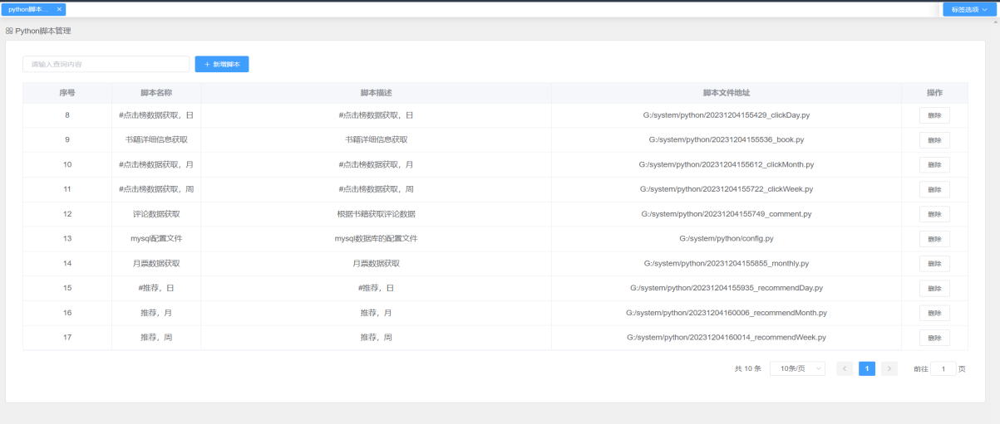

图5-2 脚本列表

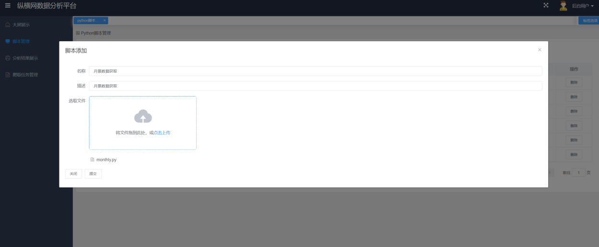

图5-3 脚本增加

爬取任务管理

功能概述

用户可以查看任务列表并添加新任务。在任务添加界面，用户选择任务执行脚本后点击添加，系统自动将任务状态设置为待执行，并保存任务信息到数据库。用户可以点击开始按钮启动任务，系统根据任务主键获取任务信息和脚本信息，使用 ProcessBuilder 指定要执行的 Python 脚本路径，并通过 Runtime.getRuntime().exec 方法启动新进程执行脚本。系统还支持定时任务，使用 Scheduled 注解和 Cron 表达式来自动执行脚本获取数据。

关键代码

爬取任务保存关键代码如代码5-3所示，该代码是一个 POST 请求的处理器方法，用于保存任务信息到数据库，并将任务状态设置为待执行，代码使用了MyBatis-Plus封装好的CURD方法。

代码53 爬取任务保存

<table>
<tr><td>@PostMapping(&quot;/saveTask&quot;) @isLogin public void saveTask(@RequestBody Task task) { task.setTaskStatus(&quot;待执行&quot;); taskService.save(task); }</td></tr>
</table>

任务列表查询关键代码如代码5-4所示。首先根据搜索条件构建查询条件，然后使用 taskService 进行分页查询，获取任务列表。最后，遍历任务列表，为每个任务设置对应的脚本信息，并返回分页结果。

代码54 任务列表查询

<table>
<tr><td>@PostMapping(&quot;/taskList&quot;) @isLogin public Page&lt;Task&gt; taskList(@RequestBody SearchVto searchVto) { QueryWrapper&lt;Task&gt; queryWrapper = new QueryWrapper(); if (!searchVto.getLikeString().equals(&quot;&quot;)) { queryWrapper.like(&quot;task_name&quot;， searchVto.getLikeString()); } Page&lt;Task&gt; taskPage = taskService.page(new Page&lt;Task&gt;(searchVto.getPageIndex()， searchVto.getPageSize())， queryWrapper); for (Task record : taskPage.getRecords()) { record.setScript(scriptService.getById(record.getTaskScriptId())); } return taskPage; }</td></tr>
</table>

任务执行关键代码如代码5-5所示，首先获取任务信息和对应脚本路径，然后使用 Runtime.getRuntime().exec() 创建 Python 脚本执行进程。通过读取进程的输出和错误输出来监控执行情况，并将输出信息保存到任务对象中。最后，等待进程执行结束并判断执行结果，根据执行结果更新任务状态，并将任务信息持久化到数据库中。异常捕获用于处理执行过程中可能出现的异常，并打印异常信息。

代码55 任务执行

<table>
<tr><td>// 读取进程输出 BufferedReader reader = new BufferedReader(new InputStreamReader(process.getInputStream())); String line; while ((line = reader.readLine()) != null) { System.out.println(line); } // 读取进程错误输出 BufferedReader errorReader = new BufferedReader(new InputStreamReader(process.getErrorStream())); String errorLine; while ((errorLine = errorReader.readLine()) != null) { System.err.println(errorLine); task.setInfo(errorLine);</td></tr>
</table>

效果展示

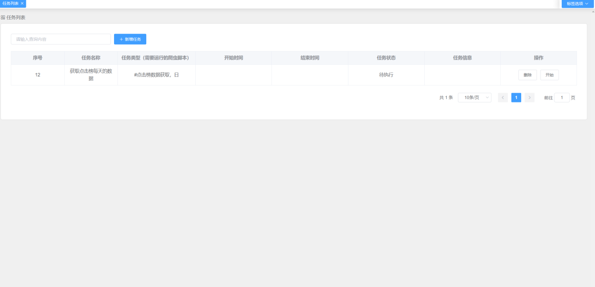

图5-4 任务列表

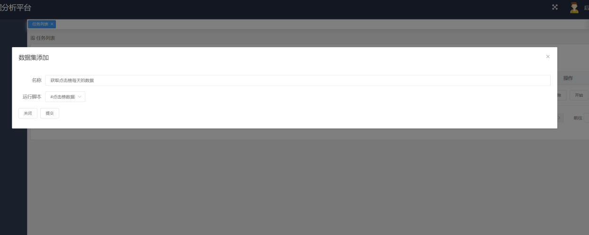

图5-5 任务添加

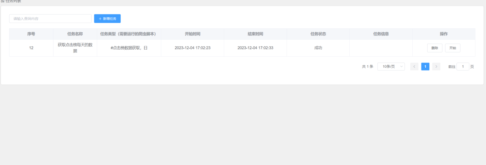

图5-6 任务执行

数据获取

功能概述

实现了对书籍评论信息的爬取功能。通过配置数据库连接，获取书籍ID，并构造请求URL，发送请求获取评论数据。随后，解析返回的JSON数据，提取评论内容、作者、时间等信息，并将其存储到数据库中。

关键代码

数据爬取关键代码如代码5-6所示，代码开始处导入了必要的模块，并从config.py中导入数据库配置（db_config和engine）。然后获取书籍ID：get_bookids()函数从数据库的books表中查询所有的书籍ID。使用SQLAlchemy库来反射数据库表并执行查询。获取评论数据：get_comment_data()函数根据书籍ID构造请求URL，发送请求到指定的网址，然后解析返回的JSON数据，提取出评论内容、作者、时间等信息，并将这些信息存储在字典中。保存评论数据：save_comment_data()函数将从网站上获取的评论数据保存到数据库的comments表中。多线程爬取：程序使用ThreadPoolExecutor来创建一个线程池，通过main()函数并行执行worker()函数。worker()函数负责调用get_comment_data()和save_comment_data()函数来爬取和保存数据。错误处理和日志记录：在save_comment_data()函数中，代码通过try-except块处理了可能的数据库插入错误，并在成功或失败时打印相应的日志信息。剩下脚本的实现方式与其一致，不同的是书籍详细信息返回的内容为HTML文档，这里使用了BeautifulSoup进行数据的提取，主要提取了书籍名称，作者，书籍总票数，总字数，分类等信息。

代码56 数据爬取

<table>
<tr><td># 解析HTML内容，创建BeautifulSoup对象 soup = BeautifulSoup(response.text， &quot;html.parser&quot;) data[&#x27;bookId&#x27;] = bookId # 获取书籍名称 book_name = soup.find(&quot;div&quot;， class_=&quot;book-info--title&quot;).span.text data[&#x27;bookName&#x27;] = book_name print(&quot;书籍名称：&quot;， book_name) # 获取书籍类型 book_type = soup.find(&quot;span&quot;， class_=&quot;cateFineId&quot;).text.replace(&quot;\n&quot;，&#x27;&#x27;).replace(&quot; &quot;，&#x27;&#x27;) data[&#x27;bookType&#x27;] = book_type print(&quot;书籍类型：&quot;， book_type) # 获取包含数字和单位的div标签 soupTotal = soup.find(&quot;div&quot;， &quot;book-info--nums&quot;) # 获取所有的span标签，存储数字 spans = soupTotal.find_all(&quot;span&quot;) # 获取所有的i标签，存储单位 i = soupTotal.find_all(&quot;i&quot;)</td></tr>
</table>

效果展示

图5-7 数据脚本执行情况

点击榜数据可视化

功能概述

通过饿了么UI的Table组件和el-pagination分页组件展示数据。在created生命周期中定义数据请求方法getList，通过Axios请求clickList接口，传入查询参数。接口中使用查询包装器构建数据库查询，根据请求参数进行条件判断，应用不同的查询条件。最后使用服务层的page方法执行分页查询，将结果返回给前端。前端通过双向绑定渲染结果。

关键代码

关键代码如代码5-7所示，if (!searchVto.getLikeString().isEmpty())：如果搜索字符串不为空，则在bookName、pseudonym、cateFineName字段上应用 LIKE 查询。 if(!searchVto.getIsPython().isEmpty())：如果isPython字段不为空，则对该字段应用等于（eq）条件。if(!searchVto.getType().isEmpty())：如果type字段不为空，则对该字段应用等于（eq）条件。if(searchVto.getOrderBy().equals("1"))：如果orderBy字段为 "1"，则根据number和rankNo字段降序排序。否则，根据number升序和rankNo降序排序，最后使用服务层的page方法执行分页查询。它创建了一个新的Page<Click>对象，其中包含了分页参数（如页码和页面大小），并使用之前构建的queryWrapper作为查询条件，将结果返回给前端，前端通过双向绑定进行值得绑定，渲染结果。

代码57 点击榜数据可视化

<table>
<tr><td>@PostMapping(&quot;/clickList&quot;) @isLogin public Page&lt;Click&gt; clickPage(@RequestBody SearchVto searchVto) { QueryWrapper&lt;Click&gt; queryWrapper = new QueryWrapper(); if (!searchVto.getLikeString().isEmpty()) { queryWrapper.like(&quot;bookName&quot;， searchVto.getLikeString()).or().like(&quot;pseudonym&quot;， searchVto.getLikeString()).or().like(&quot;cateFineName&quot;， searchVto.getLikeString()); } if(!searchVto.getIsPython().isEmpty()){ queryWrapper.eq(&quot;isPython&quot;，searchVto.getIsPython()); } if(!searchVto.getType().isEmpty()){ queryWrapper.eq(&quot;type&quot;，Integer.valueOf(searchVto.getType())); } if(searchVto.getOrderBy().equals(&quot;1&quot;)){ queryWrapper.orderByDesc(&quot;number&quot;).orderByDesc(&quot;rankNo&quot;); }else { queryWrapper.orderByAsc(&quot;number&quot;).orderByDesc(&quot;rankNo&quot;); } return clickService.page(new Page&lt;Click&gt;(searchVto.getPageIndex()， searchVto.getPageSize())， queryWrapper); }</td></tr>
</table>

效果展示

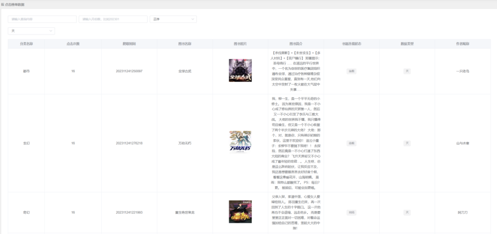

图5-8 点击榜数据

评论情感分析

功能概述

用户可通过界面选择书籍，查看对应评论的情感分析结果。系统通过Axios请求服务端接口，传入书籍ID，初始化Spark会话并从数据库中读取评论数据，根据书籍ID过滤、清洗、去重评论，并使用阿里云的NPLAPI进行情感分析。分析结果以可视化图表形式呈现，包括词云图、正负面评论环形图等。用户可实时了解用户对书籍的情感倾向，帮助作者做出更好的情绪或舆论引导。

关键代码

情感分析关键代码如代码5-8所示，首先初始化一个Spark会话，从数据库中读取评论数据，根据书籍ID（前端传递而来的参数）过滤评论，清洗数据，去除评论中的HTML标签，并去除重复的评论，对每条评论进行情感分析-使用阿里云的NPLAPI，将结果收集为一个列表，并返回这个列表，然后前端使用echarts模块的pie与wordCloud进行可视化图像的制作。用户可以通过次功能，实时掌握用户对该书籍的情绪走向，也可以帮助作者掌握情绪走向，进行更好的情绪或者舆论引导。

代码58 情感分析

<table>
<tr><td>// 数据清洗 Dataset&lt;Row&gt; cleanedData = filteredComments .withColumn(&quot;content&quot;， functions.regexp_replace(functions.col(&quot;content&quot;)， &quot;&lt;[^&gt;]+&gt;&quot;， &quot;&quot;)).distinct(); // 应用情感分析 Dataset&lt;SentimentRow&gt; withSentiment = cleanedData.mapPartitions( (MapPartitionsFunction&lt;Row， SentimentRow&gt;) iterator -&gt; { List&lt;SentimentRow&gt; results = new ArrayList&lt;&gt;(); while (iterator.hasNext()) { Row row = iterator.next(); String content = row.getAs(&quot;content&quot;); // 使用 HanLP 进行情感分析 String sentiment = analyzeSentimentWithHanLP(content); SentimentRow sentimentRow = new SentimentRow(); sentimentRow.setContent(content); sentimentRow.setNickName(row.getAs(&quot;nickName&quot;)); sentimentRow.setCreateTime(row.getAs(&quot;createTime&quot;)); sentimentRow.setIpRegion(row.getAs(&quot;ipRegion&quot;)); sentimentRow.setSentiment(sentiment); results.add(sentimentRow);</td></tr>
</table>

效果展示

图5-9 书籍评论情感分析界面

书籍分析

功能概述

获取基于粉丝数、关键词数、推荐算法的Top图书数据，并获取所有Top图书数据。待任务完成后，处理数据并封装成特定格式返回给前端。前端根据返回数据初始化词云图、柱状图、散点图等图表，展示最受欢迎的书籍、粉丝数最多的书籍以及书籍点击与字数的关系，帮助用户与作者进行书籍质量的把握，提供数据分析支持。

关键代码

书籍分析关键代码如代码5-9所示，在服务端中首先创建一个含有4个线程的线程池，通过线程池提交了四个异步任务，每个任务调用booksMapper的不同方法来获取数据：selectTopBooksByFans()：获取基于粉丝数的Top图书；selectTopBooksByWords()：获取基于关键词数的Top图书；selectTopBooksByRecommend()：获取基于推荐算法的Top图书；selectTopBooks()：获取所有Top图书。这些任务被封装在Future对象中，以便异步执行.等待任务完成并获取结果：使用Future.get()方法等待每个任务的完成，并获取返回的结果。这一步会阻塞直到相应的任务完成。处理数据：提取所有Top图书的名称、值和点击数。提取推荐算法推荐的图书名称和值，构建数据对象：创建line对象，包含推荐算法推荐的图书名称和值。创建lines对象，包含所有Top图书的名称、值和点击数。

代码59 任务列表查询

<table>
<tr><td>// 提交任务：根据粉丝数获取Top图书 Future&lt;List&lt;BookAnalysis.WordCloud&gt;&gt; fansFuture = executor.submit(() -&gt; booksMapper.selectTopBooksByFans()); // 提交任务：根据关键词数获取Top图书 Future&lt;List&lt;BookAnalysis.WordCloud&gt;&gt; wordsFuture = executor.submit(() -&gt; booksMapper.selectTopBooksByWords()); // 提交任务：根据推荐算法获取Top图书 Future&lt;List&lt;BookAnalysis.WordCloud&gt;&gt; recommendFuture = executor.submit(() -&gt; booksMapper.selectTopBooksByRecommend()); // 提交任务：获取所有Top图书 Future&lt;List&lt;BookAnalysis.WordCloud&gt;&gt; dataFuture = executor.submit(() -&gt; booksMapper.selectTopBooks()); // 获取根据粉丝数获取Top图书的结果 List&lt;BookAnalysis.WordCloud&gt; fansData = fansFuture.get(); // 获取根据关键词数获取Top图书的结果 List&lt;BookAnalysis.WordCloud&gt; wordsData = wordsFuture.get(); // 获取根据推荐算法获取Top图书的结果 List&lt;BookAnalysis.WordCloud&gt; recommendData = recommendFuture.get(); // 获取所有Top图书的结果 List&lt;BookAnalysis.WordCloud&gt; data = dataFuture.get();</td></tr>
</table>

效果展示

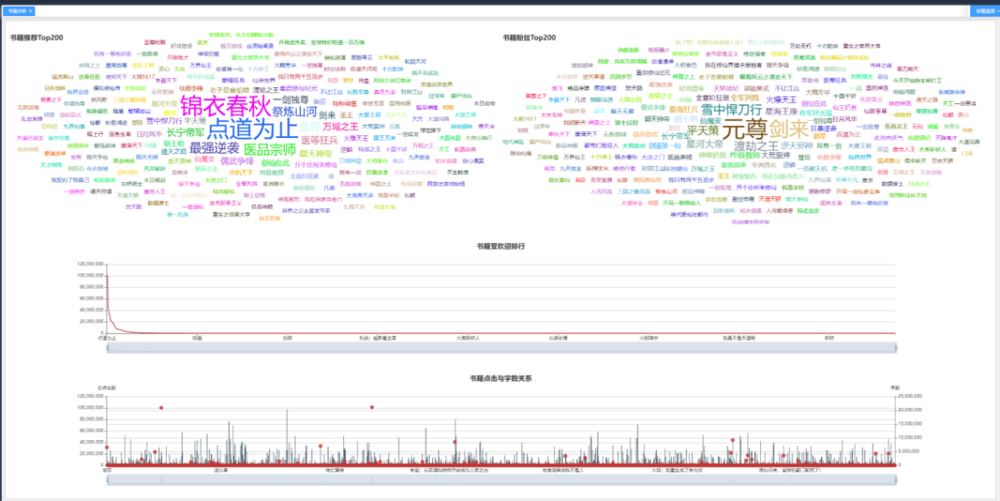

图5-10 书籍分析界面

榜单分析

功能概述

，通过Spring Boot构建后端服务，使用Vue作为前端框架，实现了榜单数据的展示与分析。用户可以通过界面直观地查看各类榜单数据，并进行数据分析，以便更好地了解和利用系统中的数据。

关键代码

榜单分析关键代码如代码5-10所示，通过monthMapper查询获取月度词云图数据，然后提取名称和值，并将结果封装为line对象。接着查询获取点击数饼图数据和推荐数饼图数据，并将所有数据封装为BookAnalysis对象返回。

代码510 榜单分析

<table>
<tr><td>public BookAnalysis monthsLine(String bookId) { List&lt;BookAnalysis.WordCloud&gt; months = monthMapper.monthsLine(bookId); List&lt;String&gt; name = months.stream().map(BookAnalysis.WordCloud::getName).collect(Collectors.toList()); // 获取所有Top图书的值 List&lt;Integer&gt; value = months.stream().map(BookAnalysis.WordCloud::getValue).collect(Collectors.toList()); List&lt;BookAnalysis.WordCloud&gt; clicks = monthMapper.clicksPie(bookId); List&lt;BookAnalysis.WordCloud&gt; recommonds = monthMapper.recommondsPie(bookId); return new BookAnalysis(new BookAnalysis.line(name， value)，clicks，recommonds); }</td></tr>
</table>

效果展示

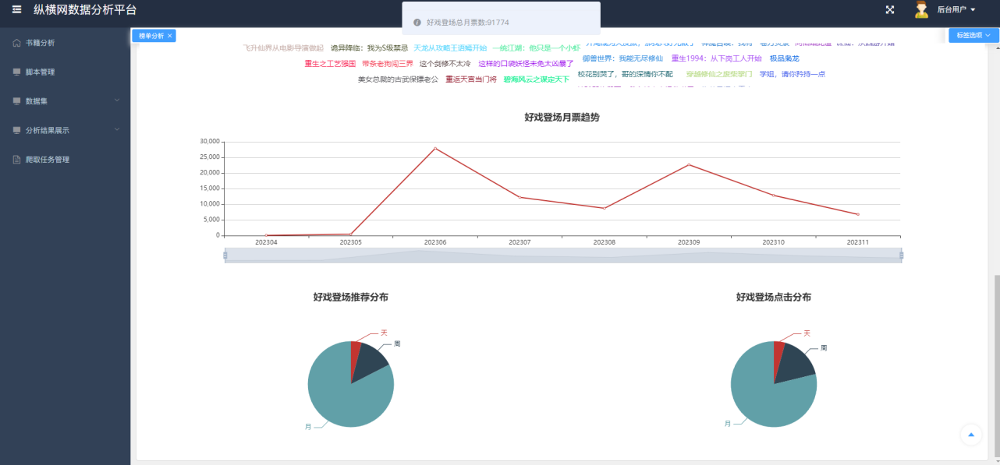

图5-11 榜单分析界面

本章小结

本章将详细探讨如何利用Python和Java代码，以及Vue、Spring Boot、MyBatis-Plus和SparkSQL等技术来实现系统的登录、脚本管理、爬取任务管理、清洗结果展示以及数据分析等功能。

除此之外，本章呈现了界面实现的结果，并提供关键代码步骤的解析，以便后续的测试工作进行。与此同时，本章还将探讨每种技术的优势和适用场景，以及它们之间的协作方式。对详细分析每个功能模块所需的技术支持，读者能够更好地理解系统架构的设计原理和实现思路。这些内容将继续为读者提供全面的知识和技能，使其能够在真正的实际项目中灵活运用所学知识，解决各种挑战和难题。

## 系统测试

测试方法与环境

本系统拟采用黑盒测试的方法，通过测试来检测每个功能是否都能正常使用。在测试中，把程序看作一个不能打开的黑盒子，在完全不考虑程序内部结构和内部特性的情况下，在程序接口进行测试，它只检查程序功能是否按照需求规格说明书的规定正常使用，程序是否能适当地接收输入数据而产生正确的输出信息。

系统在开发环境下进行测试：

操作系统：Windows11；

开发语言版本：Python3.7;JDK 1.8；MySQL 8.0.19;SparkSQL3.1.2，Node 15.6；

编译器：WebStorm，IDEA，Pycharm。

功能测试

登录功能测试

系统登录测试，主要测试系统服务端是否正常对密码进行签名，是否可以正常拦截错误的账号与密码，登录成功UI是否自动跳转界面到首页，且服务端是否生成JWT，然后UI其他页面是否判断了当前操作用户是否进行了登录，测试用例如表6-1所示。

表6-1 登录测试用例表

<table>
<tr><td>名称</td><td colspan="3">登录测试用例</td></tr>
<tr><td>概述</td><td colspan="3">测试账号与密码验证逻辑是否与设计一致 测试登录成功，接口是否返回了JWT，UI是否跳转也页面 未登录的用户进入首页UI是否进行了限制，接口是否进行了限制 系统提前存入用户：admin，123456</td></tr>
<tr><td>步骤</td><td>步骤</td><td colspan="2">步骤与预期结果</td></tr>
<tr><td></td><td>1</td><td colspan="2">未登录的用户，浏览器输入系统首页</td></tr>
<tr><td></td><td>2</td><td colspan="2">登录界面输入账号admin，密码12345</td></tr>
<tr><td></td><td>3</td><td colspan="2">登录界面输入账号admin，密码123456</td></tr>
<tr><td colspan="4">测试结果</td></tr>
<tr><td>结果</td><td>1a</td><td>用户未登录，UI跳转登录界面，接口被拦截</td><td>通过</td></tr>
<tr><td></td><td>2a</td><td>登录界面提示账号与密码错误</td><td>通过</td></tr>
<tr><td></td><td>3a</td><td>提示登录成功，UI跳转首页，接口返回了生成的JWT</td><td>通过</td></tr>
</table>

脚本与爬取任务功能测试

脚本管理与爬取任务管理是系统数据获取的主要手段，这块的测试主要保证数据获取的稳定，测试用例如表6-2所示。

表6-2 脚本管理与爬取任务管理

<table>
<tr><td>名称</td><td colspan="3">脚本管理与爬取任务管理</td></tr>
<tr><td>概述</td><td colspan="3">测试脚本的增加，删除，查询 测试爬取任务的创建 测试爬取任务的列表查询，删除 测试爬取任务的手动执行与自动执行 测试爬取任务执行后，结果的查看是否正常</td></tr>
<tr><td>步骤</td><td>步骤</td><td colspan="2">步骤与预期结果</td></tr>
<tr><td></td><td>1</td><td colspan="2">登录进入系统，上传Python脚本：爬取</td></tr>
<tr><td></td><td>2</td><td colspan="2">在脚本管理中，对脚本进行搜索，并删除步骤1创建的脚本</td></tr>
<tr><td></td><td>3</td><td colspan="2">进入爬取任务管理，创建新的爬取任务：任务，选择脚本（脚本已经测试通过）</td></tr>
<tr><td></td><td>4</td><td colspan="2">进入爬取任务管理，进行查询，并删除任一一个任务</td></tr>
<tr><td></td><td>5</td><td colspan="2">手动执行步骤3创建的任务，然后等待系统自动执行任务</td></tr>
<tr><td></td><td>6</td><td colspan="2">查看“任务”的执行结果</td></tr>
<tr><td colspan="4">测试结果</td></tr>
<tr><td>结果</td><td>1a</td><td>爬取脚本上传成功</td><td>通过</td></tr>
<tr><td></td><td>2a</td><td>在脚本管理中的列表界面，输入爬取，查询成功，且是分页查询，然后删除脚本爬取，删除成功</td><td>通过</td></tr>
<tr><td></td><td>3a</td><td>创建爬取任务：“任务”成功</td><td>通过</td></tr>
<tr><td></td><td>4a</td><td>查询成功，并能删除其他任务</td><td>通过</td></tr>
<tr><td></td><td>5a</td><td>任务手动与自动执行成功，UI与系统没有报错</td><td>通过</td></tr>
<tr><td></td><td>6a</td><td>查看“任务”执行结果成功，显示两条数据：手动执行与自动执行</td><td>通过</td></tr>
</table>

分析功能测试

这里主要测试，情感分析，书籍分析和榜单分析数据分析部分测试主要测试分析结果是否准确，系统界面是否可以正常按照设计一样渲染需要被渲染的图形，系统接口部分是否有报错，测试结果如表6-3所示。

表6-3 数据分析测试

<table>
<tr><td>名称</td><td colspan="3">数据分析测试用例</td></tr>
<tr><td>概述</td><td colspan="3">测试评论情感分析界面与接口是否正常 测试书籍分析界面与接口是否正常 测试榜单分析界面与接口是否正常 测试上述分析是否有接口拦截，用户未登录，是否可以访问上述功能</td></tr>
<tr><td>步骤</td><td>步骤</td><td colspan="2">步骤与预期结果</td></tr>
<tr><td></td><td>1</td><td colspan="2">用户未登入系统，访问评论情感分析/书籍分析/榜单分析</td></tr>
<tr><td></td><td>2</td><td colspan="2">用户登入系统访问评论情感分析，选择不同的书籍</td></tr>
<tr><td></td><td>3</td><td colspan="2">用户登入系统访问书籍分析，选择不同的书籍</td></tr>
<tr><td></td><td>4</td><td colspan="2">用户登入系统访问榜单分析，选择不同的书籍</td></tr>
<tr><td colspan="4">测试结果</td></tr>
<tr><td>结果</td><td>1a</td><td>接口提示请登录，界面跳转登录界面</td><td>通过</td></tr>
<tr><td></td><td>2a</td><td>书籍选择下拉框渲染成功，选择其中书籍后，界面出现评论情感分析结果，饼状图，词云图出现成功；选择另外一本书籍，结果有所变化</td><td>通过</td></tr>
<tr><td></td><td>3a</td><td>书籍词云图展示成功，下方的柱状线条图展示成功</td><td>通过</td></tr>
<tr><td></td><td>3b</td><td>点击书籍词云图后，界面成功展示了该书籍的基本信息与票据书籍，并且词云图大小也是根据票据数据而来</td><td>通过</td></tr>
<tr><td></td><td>4a</td><td>榜单分析界面中，榜单前200名书籍词云图渲染成功</td><td>通过</td></tr>
<tr><td></td><td>4b</td><td>点击词云图中的任一书籍，界面下方展示了该书籍的榜单走向趋势，展示了该书籍的其他榜单信息</td><td>通过</td></tr>
</table>

本章小结

系统经过严格的黑盒测试验证了各项功能，包括但不限于登录、脚本管理、爬取任务管理、数据实时爬取以及数据分析等，测试结果充分证明系统具备出色的稳定性和可靠性。用户的需求能够得到充分满足，系统运行正常。这一成果不仅为系统的推广应用打下了坚实基础，也为未来的进一步优化提供了重要参考。

系统经过严格的黑盒测试后，这是对系统的易用性和功能强大性给予了高度肯定，这为系统的推广应用和未来的持续优化有着极大地加持。测试结果不仅是对系统设计和实现有帮助，也是对团队不懈努力和精益求精的最好回报。

## 结束语

工作总结

本研究通过深入分析和处理纵横小说网的数据，展现了大数据技术在文学领域的应用潜力。随着互联网的蓬勃发展，纵横小说网成为了读者和作者互动的重要平台，汇聚了大量作品和读者。

在信息化时代大量数据繁衍而生，而小说的类型尤其是网站备受青睐，从而海量数据存在于纵横小说网，这些海量的数据可以产生多方方面的价值，所以以此做出一个纵横小说网的系统分析平台。

Python爬虫技术方面，我们成功地获取了网站的丰富数据，对爬取到的数据进心充分的处理，并通过数据清理和MySQL数据库存储，将其有效整理和管理。另外，在此基础上设计并使用了爬虫脚本来使能够更加地方便直观去在分析平台进行任务的处理，我们只需要上传脚本，添加脚本，然后对脚本执行就能得到相应的数据，同时也能看到历史脚本的操作。

数据分析方面，采用了Spark SQL进行深入研究，揭示了用户的阅读偏好和趋势。这对于了解阅读市场、掌握用户需求和发现优秀作者和作品都具有重要意义。

功能设计方面，对于常见的功能书籍分析，各种榜单数据（月票，推荐，点击），数据分析都有完成，然后对于其他的功能涉及有脚本的添加和管理，情感的分析也有完成。为了将功能有一个更好地呈现，为每一个功能设计了原型设计，原型设计做一个提前预演的效果，原型设计里面的动态面板、中继器以及各种交互等等都是不错的器件和功能，让我们做功能更加好上手。

数据展示方面，通过建立一个交互式的数据展示系统，借助Spring Boot和Vue技术，数据不再仅仅停留在分析层面，而可以以可视化的方式呈现，使用户能够轻松发起数据生成请求并查看历史任务结果。

测试方面，通过设计多个功能的模块测试来分析模块功能是否可行，是否能够达到想要的效果，最终测试成功。

总之，本研究的应用大数据分析与处理技术有望推动网络文学领域的进一步发展。这不仅有助于满足读者和作者的需求，还为文学创作和传播提供了实际支持。通过深入研究纵横小说网的数据，我们可以更好地洞察阅读市场趋势，为读者提供更符合其兴趣的作品，同时也为优秀作者提供更多的机会展示自己的作品。

展望

虽然本研究在纵横小说网的数据分析和处理方面取得了一定的成果，但仍有许多方面需要进一步改进和完善。

在登录功能设计方面，我们目前仅实现了基本的账号密码登录功能，并采用了MD5加密来保障用户信息安全。然而随着网络安全威胁的不断增加，我们需要进一步加强用户信息的安全保护，考虑采用更为先进的加密技术和安全措施。

系统的稳定性是需要未来重点关注的方面。最好能够去持续优化系统的架构和代码，确保在高并发、大数据量的情况下，系统仍能保持稳定运行，为用户提供可靠的服务。

对于功能模块还可以进一步拓展平台，挑战一些具有技术难度的功能。例如，可以考虑引入自然语言处理技术，对用户的评论和反馈进行深度分析，以获取更多有价值的信息。同时，我们还可以考虑开发推荐系统，根据用户的阅读历史和偏好，为他们推荐更符合其兴趣的作品。

因为这只是一个网站,希望能够积极探索将平台拓展至移动端或微信小程序的可能性。通过开发移动应用或小程序，可以为用户提供更加便捷、个性化的服务体验，使平台更加贴近用户的需求。

总之，我们将继续持续学习网络文学领域的大数据应用，不断完善和优化平台功能，推动网络文学领域的发展和进步。期望通过努力，能够为读者和作者创造更多的价值，为网络文学领域的发展贡献一小份力量。
